 

 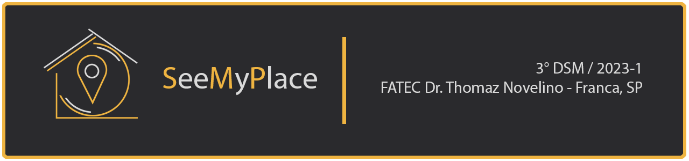

    <a href="#Suposicoes">Suposições</a>  |
    <a href="#Benchmark">Benchmark</a>  |
    <a href="#MapaJornada">Mapa de Jornadas de Usuários</a>  |
    <a href="#Rabiscoframe">Rabiscoframe</a>  |
    <a href="#Wireframe">Wireframe</a>  |  
    <a href="#Protótipo">Protótipo</a>  |  
    <a href="#StyleGuide">Style Guide</a>

## Suposições

- Acreditamos que uma aplicação que permite gerenciar todos os aspectos do processo de vendas de imóveis de forma eficiente e simplificada é a melhor opção para a empresa. Para validar essa ideia, iremos realizar testes piloto ou protótipos com usuários limitados, coletando feedbacks para ajustar a solução. Esperamos que essa solução melhore a eficiência do processo de vendas, aumentando as vendas e o lucro da empresa, além de aumentar a satisfação dos clientes com uma experiência mais organizada e transparente.

- Acreditamos que uma aplicação digital para gerenciar agendas pode melhorar a eficiência e evitar conflitos de horários em negócios e organizações. Ao centralizar as informações em uma plataforma de fácil acesso, é possível coordenar atividades e reduzir riscos de atrasos. Essa solução beneficia equipes remotas e locais, permitindo uma gestão eficiente do tempo e recursos disponíveis.

- Acreditamos fortemente que substituir agendas de papel por uma aplicação digital é essencial para aumentar a organização e eficiência da empresa, reduzir desperdício de papel e contribuir com o meio ambiente. Uma solução digital oferece melhor coordenação de tarefas, acesso a informações em tempo real e sincronização com outros dispositivos móveis. É uma ideia diferencial que trará resultados positivos em produtividade e eficiência.

- Acredito que controlar as visitas nos imóveis através de uma aplicação digital pode melhorar a experiência do cliente e aumentar a satisfação com o serviço prestado.

- Suponho que aumentar o interesse dos clientes por meio de uma aplicação digital pode aumentar a taxa de conversão de vendas. Uma possível ação seria desenvolver uma plataforma com informações detalhadas sobre produtos ou serviços. O resultado esperado seria uma melhoria na performance de vendas e na fidelização dos clientes.

 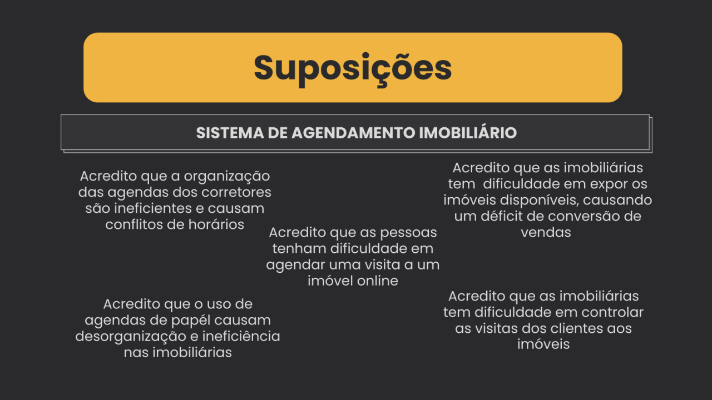
 

## Benchmark

 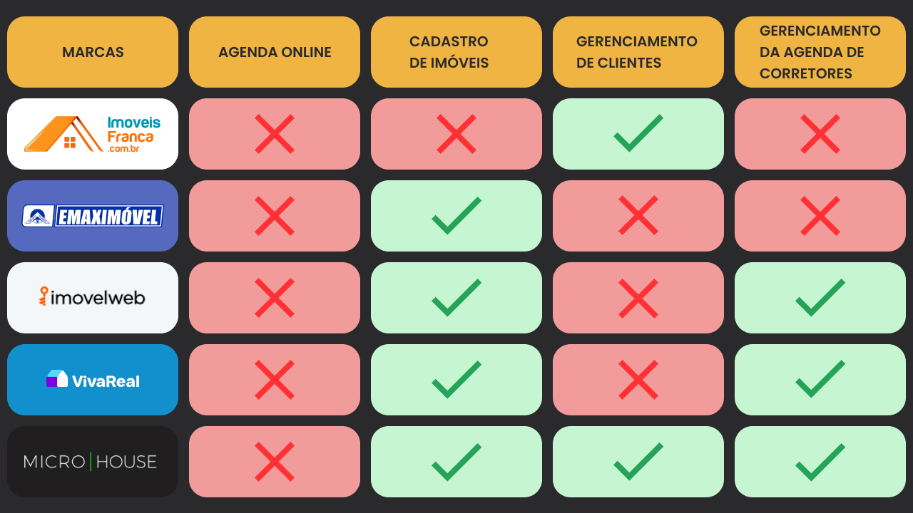
 

## Mapa de Jornadas de Usuários

 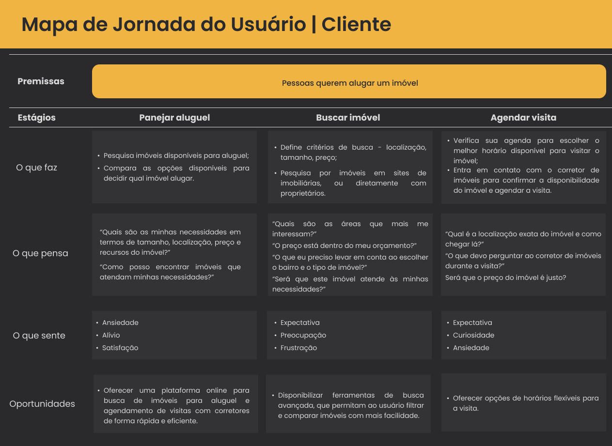
 

 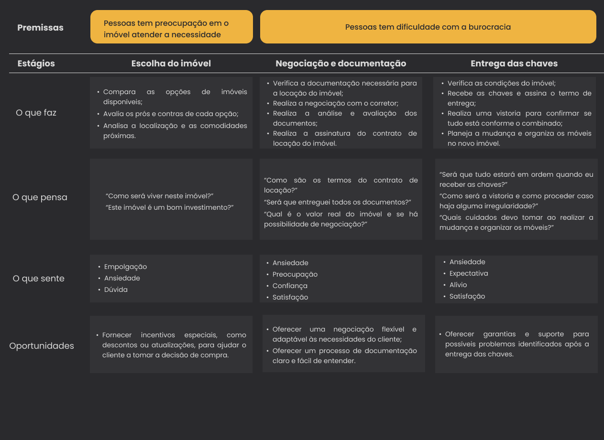
 

## Rabiscoframe

Rabiscoframe é uma técnica de design de interfaces que consiste em esboçar de forma rápida e simplificada as principais características e elementos de uma interface, com o objetivo de explorar ideias, facilitar discussões e tomar decisões iniciais antes de investir em prototipagem mais elaborada.

 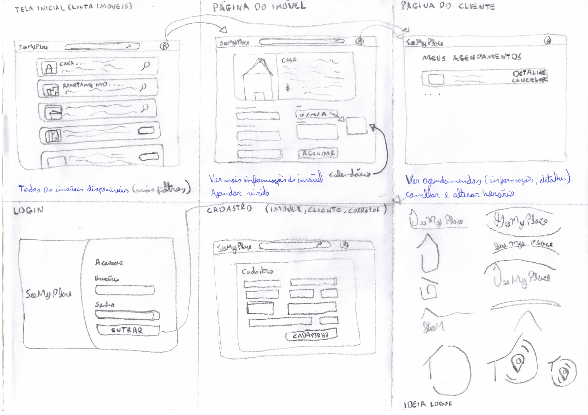
 

## Wireframe

Um wireframe é uma representação visual básica e simplificada de uma interface ou layout de página, onde são definidos a estrutura, o posicionamento dos elementos e a hierarquia visual. Ele serve como um esboço inicial para planejar a arquitetura de informações e a usabilidade, permitindo a discussão e validação da estrutura antes de se avançar para fases mais detalhadas do design.

 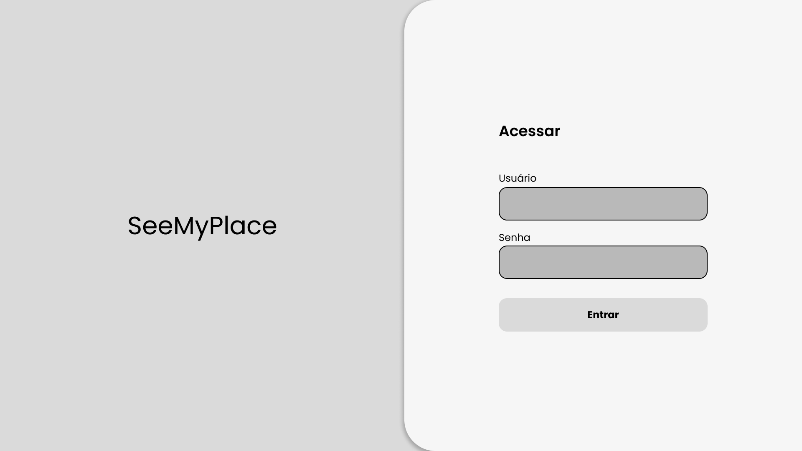
 

 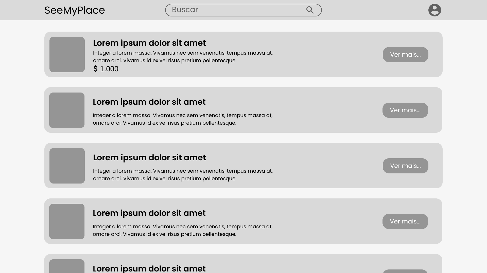
 

 
 

 
 

 
 

 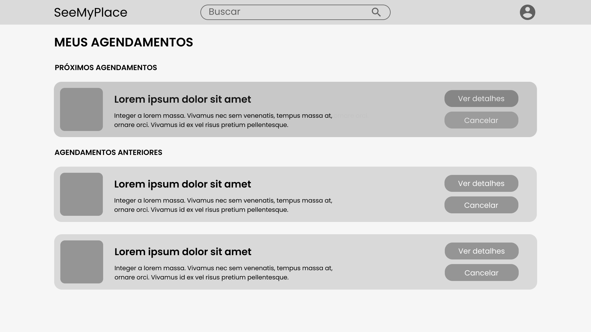
 

 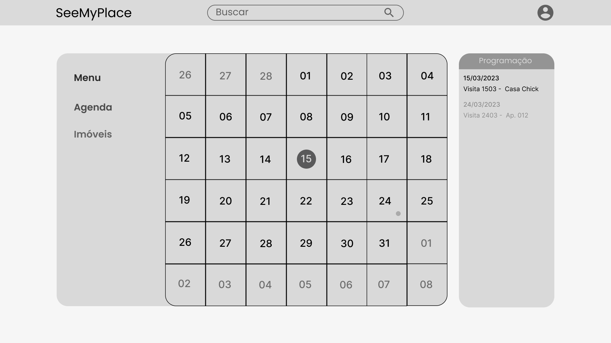
 

## Protótipo

 
 

 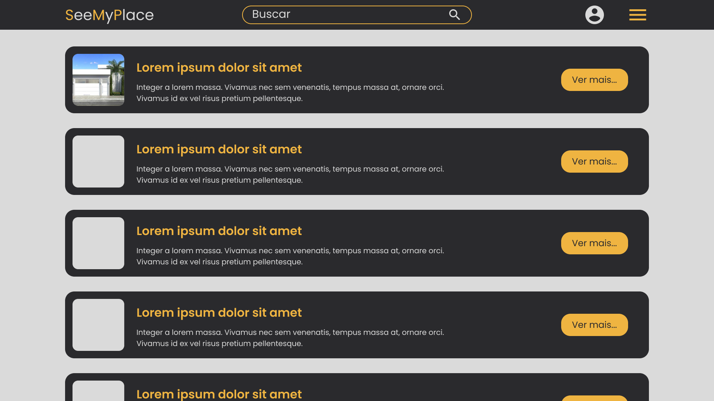
 

 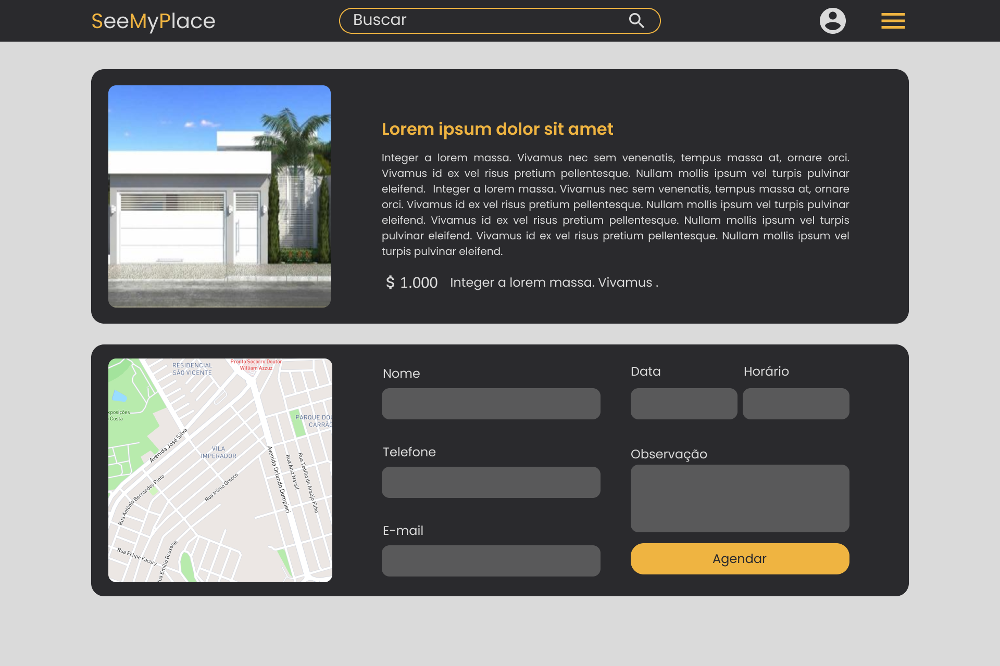
 

 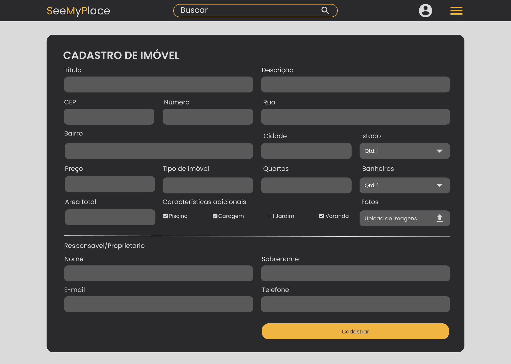
 

 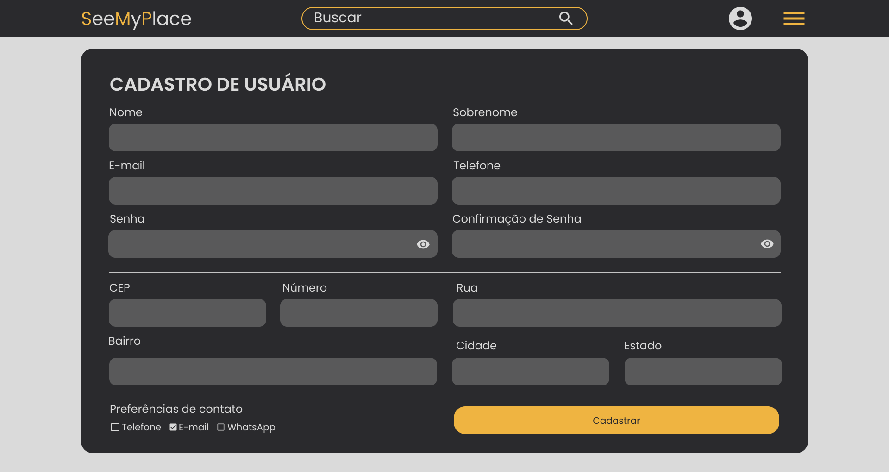
 

 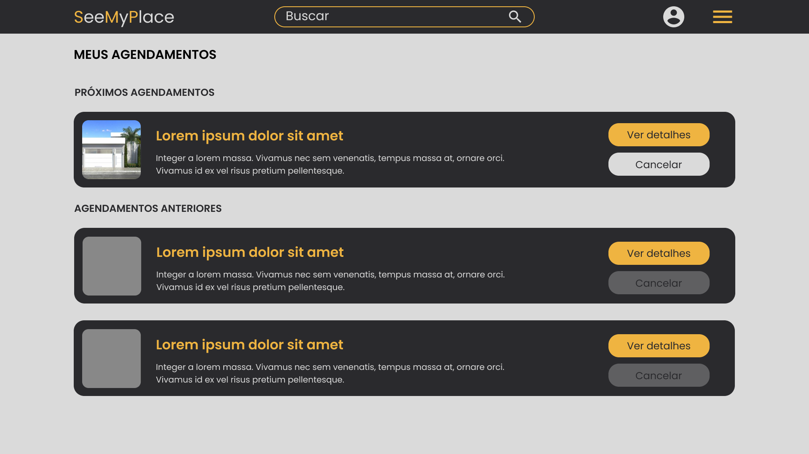
 

 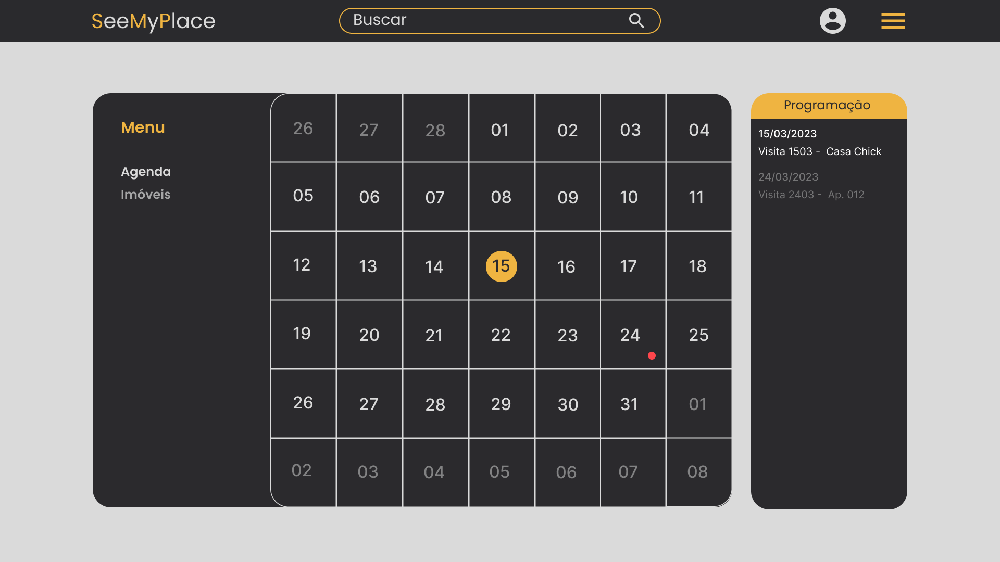
 

## Style Guide

 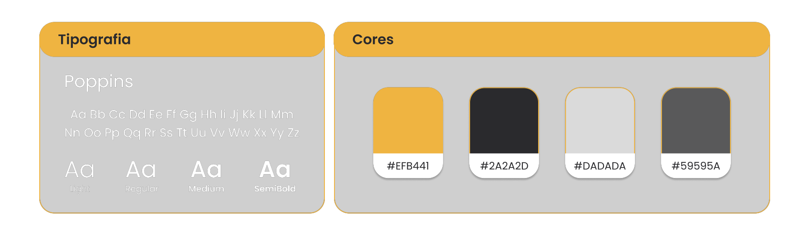
    

→ [Voltar ao topo](#topo)
